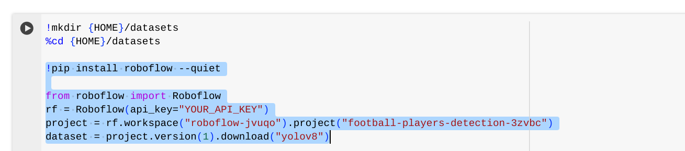

# YOLO Stack Documentation

## Description

This repository is designed for testing YOLO(You Only Look Once) models on raw videos. Included is a python test file for YOLO.v8 models in "./yolov8.py".

## Documentation

Included in this code base are two sample ".pt" files. These hold the weights for the neural networks that instanciate our YOLO models. 
One model, found in "./LLOnly180ep.pt", is an instance segmentation YOLOv8 model for detecting drivable area. The other, found in "./potholesonly100epochs.pt", is an object detection YOLOv8 model for detecting potholes. These models are used to create an occupancy grid of complete drivable area for every frame in the input video. For more information on how to use "./yolov8.py", see [Usage](#usage). For a more detailed explanation of the functionality of the code in "./yolov8.py", see [YOLOv8.py](#yolov8py).

## Table of Contents

- [Creating YOLO models](#creating-yolo-models)

- [Usage](#usage)

- [YOLOv8.py](#yolov8py)

- [TL;DR](#tldr-too-long-didnt-read)

## Creating YOLO models

The .pt files used in this project were created using [roloflow](https://app.roboflow.com/). If given access, you can access the specific roboflow projects [here](https://app.roboflow.com/arv-ysash). Roboflow is a tool that allows the user to annotate images and label their annotations for the purpose of creating CV(Computer Vision) models quickly and easily. To create your own model, create a new project and upload one or multiple training videos. Several suitable training videos can be found in the UMARV dropbox. From there, annotate every single image, then from the leftside dropdown, generate a new version of your model. From there, export the dataset in yolov8 format, copy the code snippet and navigate to the [yolov8 training notebook](https://colab.research.google.com/github/roboflow-ai/notebooks/blob/main/notebooks/train-yolov8-object-detection-on-custom-dataset.ipynb). Run all cells until you get to this one.   
Replace the highlighted text with your code snippet then run this cell. In the cell below, change the number of epochs to the desired number. Then follow the instructions to obtain your .pt file.

## Usage

To test a video using "./yolov8.py" run the terminal command  
`python3 yolov8.py <video_path> <lane_line_model_path> <pot_holes_model_path>`  
The pot hole model is optional. You may also run  
`python3 yolov8.py <video_path> 0 <pot_holes_model_path>` to use a webcam device. This functionality is only compatable on some operating systems and requires set up. Keep in mind the lane line model is intended to detect drivable area, not the lane lines themselves. 

## YOLOv8.py

This section will give a deeper explaination into the code in "./yolov8.py". The main function is the predict function, which will take a video and create an occupancy grid frame by frame. If using a webcam, it will attempt to detect in real-time, and will skip over frames if processing speed is not fast enough. This function instanciates our yolo models with the .pt files using the YOLO constructor  
`lane_model = YOLO(lane_model)`  
We then let our models detect frame by frame in the while loop. The .predict() function returns a list of predictions for every class in the model. Since our models only have one class, this is always a list of length 1. We then use `r_lane.masks.xy` to obtain a polygon of drivable area which we can highlight in our occupancy grid. The same is done with `r_hole.boxes.xyxyn`, but here we subtract from the occupancy grid. A buffer is implemented here, which, given the event that no drivable area is detected, will maintain the occupancy grids values for a certain amount of time, as a function of the occupancy grids highlighted area  
`buffer_time = math.exp(-buffer_area/(image_width*image_height)-0.7)`  
This is to ensure that if we do not detect drivable area for a few frames that we will have somewhere to go, and the robot will not stop moving. 

## TL;DR (Too Long; Didn't Read)

It is not that long.
